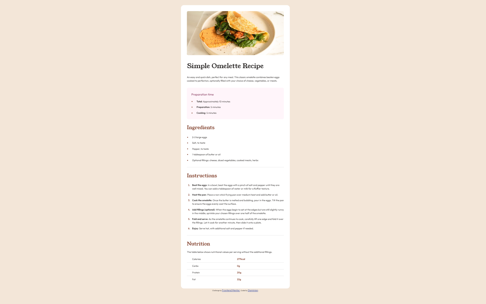

# Frontend Mentor - Recipe page solution

This is a solution to the [Recipe page challenge on Frontend Mentor](https://www.frontendmentor.io/challenges/recipe-page-KiTsR8QQKm). Frontend Mentor challenges help you improve your coding skills by building realistic projects. 

## Table of contents

- [Overview](#overview)
  - [The challenge](#the-challenge)
  - [Screenshot](#screenshot)
  - [Links](#links)
- [My process](#my-process)
  - [Built with](#built-with)
  - [What I learned](#what-i-learned)
  - [Continued development](#continued-development)
  - [Useful resources](#useful-resources)
- [Author](#author)

## Overview

### Screenshot

### Links

- Solution URL: [https://github.com/why-not-phoenix/frontend-mentor-recipe-page](https://github.com/why-not-phoenix/frontend-mentor-recipe-page)
- Live Site URL: [https://why-not-phoenix.github.io/frontend-mentor-recipe-page/](https://why-not-phoenix.github.io/frontend-mentor-recipe-page/)

## My process

### Built with

- Semantic HTML5 markup
- CSS custom properties
- Flexbox

### What I learned

This challenge tested me particularly in  handling the table at the end. I broke a few rules in fixing that and the punishment is weird looking table in different screen sizes. That is soemthing I'll definitely have to improve on.

### Continued development

Tables and Table styling

### Useful resources

- [Padding in Tables](https://stackoverflow.com/questions/1750670/how-do-you-specify-table-padding-in-css-table-not-cell-padding)

## Author

- Frontend Mentor - [@why-not-phoenix](https://www.frontendmentor.io/profile/why-not-phoenix)
- Twitter - [@dominion_onoja](https://x.com/dominion_onoja?t=RAWgmHy3YlUySDiPDnZS2g&s=09)
